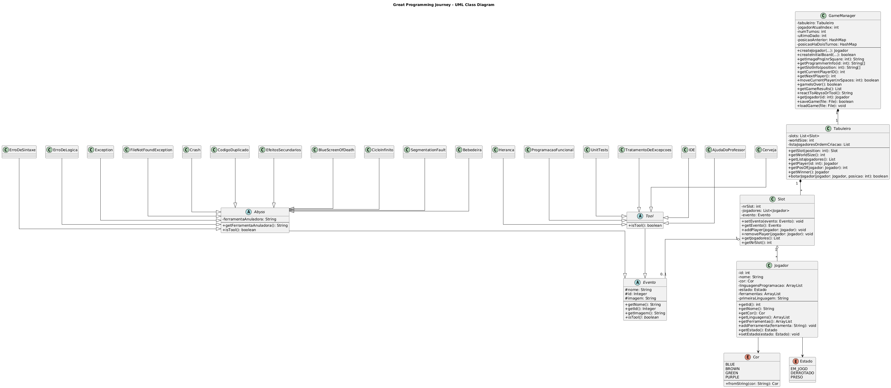

# Universidade Lusófona
## Licenciatura em Engenharia Informática
### Linguagens de Programação II
**Projeto:** The Great Programming Journey  
**Autor:** Duarte Veríssimo — nº 22303434 
**Ano letivo:** 2025/2026

*Diagrama UML:*  

*Vídeo*
https://youtu.be/SjeUCQufc6A
